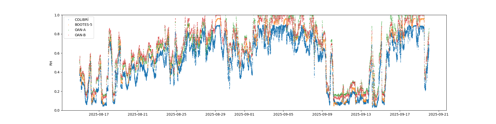

# 2025-09-30 Humidity

This plot shows the relative humidity for the second half of 2025 August and most of 2025 September for the COLIBRÍ weather station, BOOTES-5 weather station, and the two OAN weather stations.

The legend is difficult to read; COLIBRÍ is blue, BOOTES orange, and the OAN stations red and green.

Note that the BOOTES station only takes measurements at night.

The most important regime is high humidity. There are systematic offsets between the stations. COLIBRÍ tends to give a lower reading than BOOTES and BOOTES tends to give a lower reading than the OAN stations. 

Notably, the highest relative humidity reading for the COLIBRI station in this period was 0.899. For BOOTES it was 0.96 and for the OAN stations 1.00. That the COLIBRÍ station never got higher than 90% strongly suggests to me that it is not reading the correct humidity. We had several days of fog and rain during this period.
